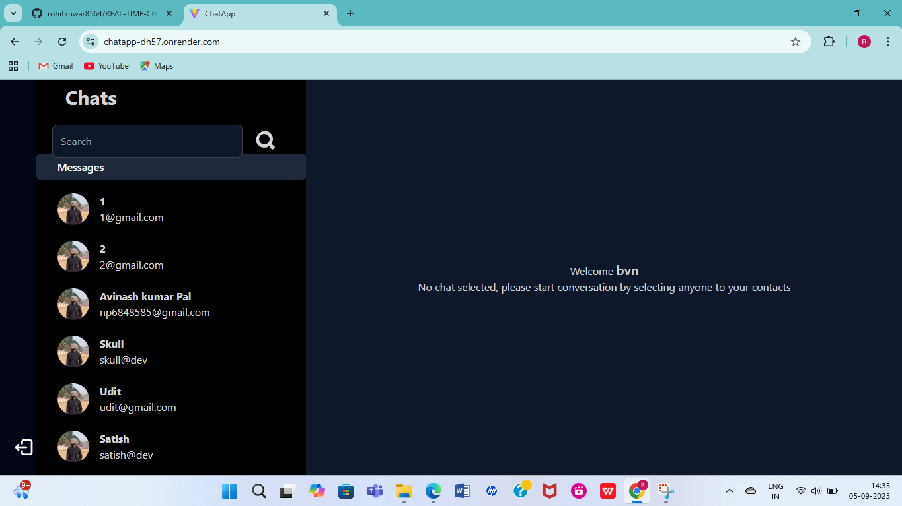
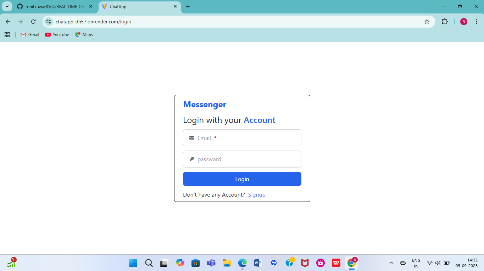
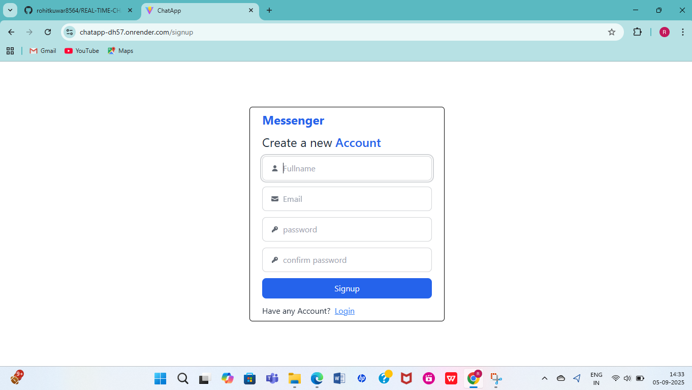

# REAL-TIME-CHAT-APPLICATION  

**COMPANY:** CODTECH IT SOLUTIONS  
**NAME:** Kuwar Rohit Dashrath  
**INTERN ID:** CT04DY1124  
**DOMAIN:** MERN Stack Web Development  
**DURATION:** 4 Weeks  
**MENTOR:** Neela Santosh  

---

## 📌 Project Description  

This project is a **Real-Time Chat Application** built using the **MERN stack (MongoDB, Express.js, React.js, Node.js)** along with **Socket.io** for real-time communication. The main purpose of this project is to demonstrate the implementation of instant messaging, user authentication, and smooth interaction between multiple clients without page refresh.  

In today’s world, chat applications have become an essential part of daily communication, whether it’s for social networking, customer support, or professional collaboration. Applications like WhatsApp, Messenger, and Slack are widely used, and this project is an attempt to build a simplified yet functional version of such real-time messaging platforms.  

### 🔹 Key Features Implemented:
1. **User Authentication (Signup & Login)**  
   - New users can create an account by entering their full name, email, and password.  
   - Existing users can log in using their credentials.  
   - Passwords are securely stored in the database using hashing techniques.  

2. **Real-Time Messaging**  
   - Implemented using **Socket.io** which enables bidirectional communication between client and server.  
   - Messages are instantly delivered without refreshing the page.  
   - Each user can view their list of conversations and engage in chats with multiple people.  

3. **Contact List & Chat UI**  
   - The sidebar displays a list of registered users with whom the logged-in user can chat.  
   - Clicking on a contact opens the chat window where messages are displayed in real time.  
   - A search functionality is also provided to quickly find contacts.  

4. **Database Integration (MongoDB)**  
   - All user information (name, email, hashed password) and messages are stored in MongoDB.  
   - Each chat history is persistent, meaning users can access past conversations whenever they log in again.  

5. **Responsive Design**  
   - Built with React.js and CSS for a clean and modern user interface.  
   - Responsive layouts ensure usability on desktops, tablets, and mobile devices.  

6. **Deployment**  
   - The project has been deployed on **Render** for backend hosting and **Vercel/Netlify** (optional) for frontend hosting.  
   - Live link is provided for real-time testing.  

---

## 🛠️ Working of the Application  

When a user signs up, their details are stored in the MongoDB database. Once logged in, they are redirected to the **Chat Dashboard**, where they can view other registered users. When a conversation is initiated, Socket.io establishes a persistent connection between the server and the clients involved.  

Whenever a user sends a message, it is emitted through the socket to the server, which then broadcasts it to the respective receiver in real time. This ensures instant message delivery and smooth communication.  

The backend is responsible for handling authentication, storing user details, and maintaining chat history, while the frontend provides an interactive and user-friendly interface.  

This project not only demonstrates real-time functionality but also covers essential concepts of **state management in React, REST API integration, secure login systems, and database connectivity**.  

---

## 📸 Screenshots  

### 🔹 Home Page  
  

### 🔹 Login Page  
  

### 🔹 Signup Page  
  

---

## 🚀 Live Demo  
👉 [Click here to try the application](https://chatapp-dh57.onrender.com/)  

---

## 📌 Conclusion  

Through this project, I gained a deep understanding of how **real-time applications** work and how crucial WebSockets are in modern web development. I also learned how to integrate multiple technologies like **MERN + Socket.io** into a single cohesive system.  

This project has improved my skills in **full-stack development**, **API handling**, **database design**, and **real-time communication systems**. The knowledge and practical exposure obtained will help me in building advanced web applications in the future.  
